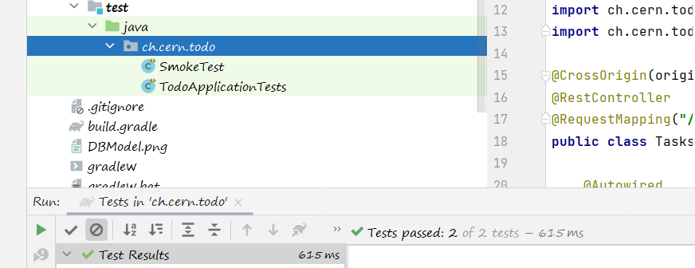
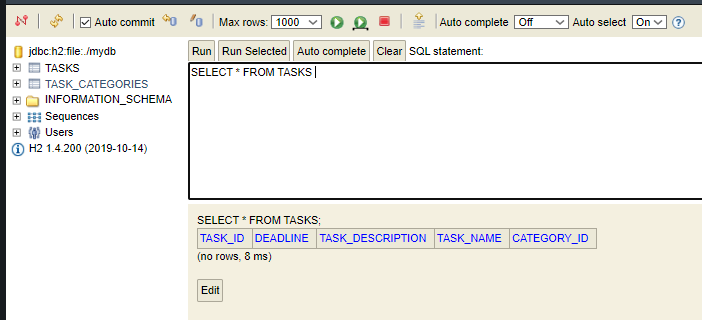
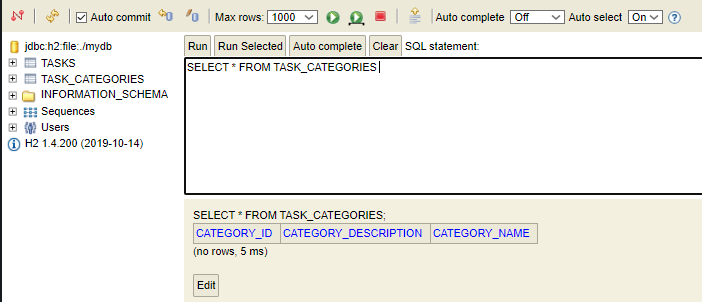
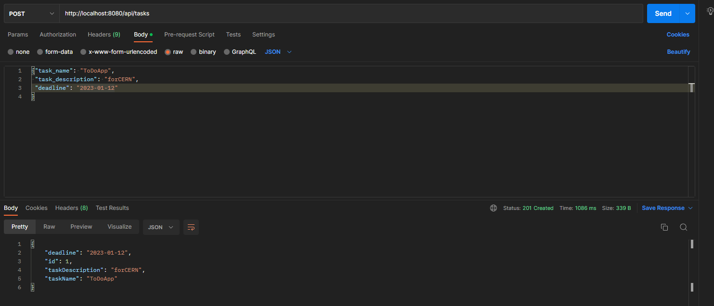
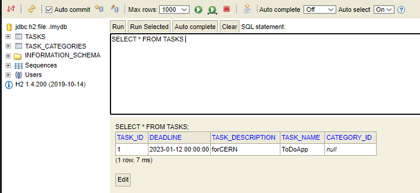

## Task description

This is a skeleton of Spring Boot application which should be used as a start point to create a working one.
The goal of this task is to create simple web application which allows users to create TODOs via REST API.

Below you may find a proposition of the DB model:

To complete the exercices please implement all missing classes and functonalites in order to be able to store and retrieve information about tasks and their categories.
Once you are ready, please send it to me (ie link to your git repository) before  our interview.

## Solution description

This is a GitHub repository with my solution proposal. Solution includes creating tables `tasks` and `task_categories` in DB and possibility to create tasks via REST API. However, tasks that can be created, do not contain information about categories. The start of the application can be tested with the use of tests, that are in directory `\src\test` and creation of new tasks can be created by sending API request via eg. Postman and running SQL queries in H2 Console.

## Tests of the solution

Below can be found the results of the tests.

To prove that the application was correctly started, we can run tests from `\src\test`.

After starting the application, in H2 Console we can check that both tables were created.

Create task via sending API request from Postman.

New task was added to the table, what can be checked in H2 Console.

##### Repository

This is the second reposotory I created for this task, first one can be found [here](https://github.com/kaczmareka/cern_todo_web_app). This is due to the problems with GitHub token and pushing commits from command line. I worked during the project on the first one, and created the second one for the final version.
